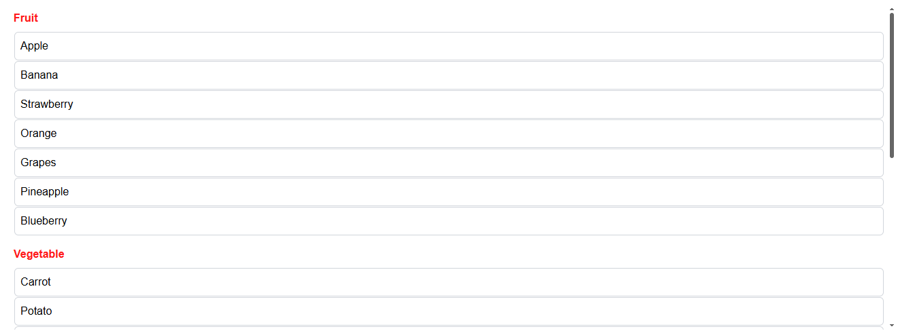

# Overview

**DataGrouper** is a reusable layout component that renders repeated content from a datasource and can optionally **group items by a selected field**.

It is built to work seamlessly with **both array datasources and entity selections**, while remaining fully compatible with the **Qodly / Webform Editor** ecosystem 


## Data Grouper component



## Datasource

| Name             | Type                   | Required | Description                                                   |
| ---------------- | ---------------------- | -------- | ------------------------------------------------------------- |
| Qodlysource      | Entity selection/Array | Yes      | Will contain the selection that will be displayed by category |
| Selected Element | Entity/Object          | No       | Will contain the currently selected element                   |
| Group by         | any                    | Yes      | the property by which the data will be grouped                |


### Custom Css

Below, is a css class sample containing all the customisable parts of the query builder component:


```css

/*to customize the category label*/
self .category-label {
}

/*to customize the content-box*/
self .content-box {
}

```
